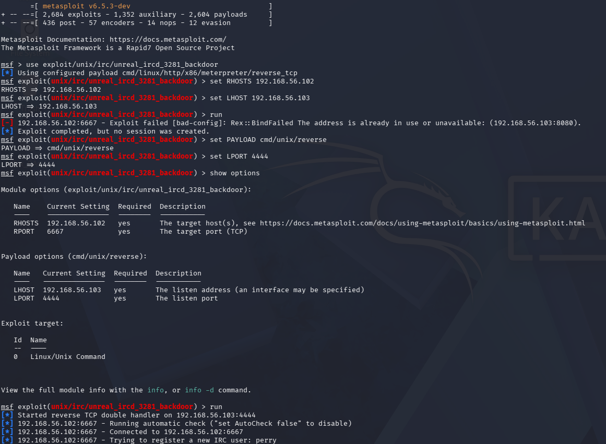
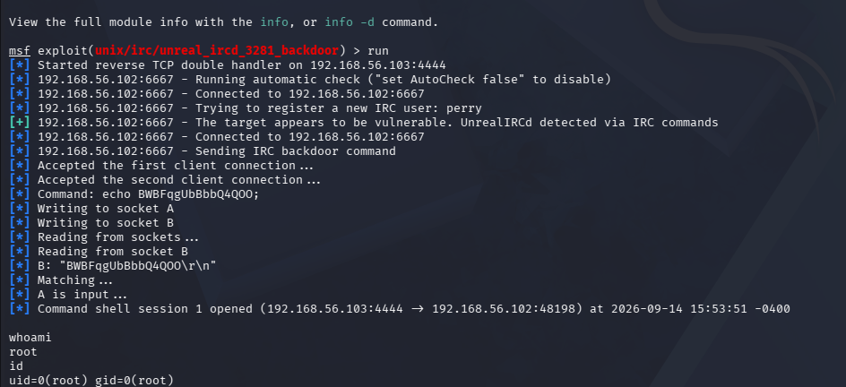

# Vulnerability Assessment Report — Metasploitable2

## Objective

This project extends the earlier vsftpd exploitation case study into a formal, risk-rated Vulnerability Assessment Report — the kind of deliverable a client or employer actually needs: not just "here's what I broke into," but a prioritized set of findings with severity ratings, exploitability evidence, and remediation guidance, similar to how the earlier Botium Toys audit rated compliance gaps by risk.

## Scope

**Target:** Metasploitable2 (192.168.56.102), isolated home lab, host-only network, no internet exposure
**Assessment type:** Unauthenticated external vulnerability scan and exploitation validation
**Tools:** Nmap (service detection + vulnerability scripting engine), SearchSploit (offline exploit database), Metasploit Framework (exploitation validation)

## Methodology

1. Service enumeration via `nmap -sV -sC` (documented in the earlier exploitation case study)
2. Cross-referenced identified service versions against SearchSploit's local exploit database to identify known, published vulnerabilities
3. Ran Nmap's vulnerability scanning engine (`nmap --script vuln`) for automated detection of common vulnerability classes (weak TLS configuration, known CVEs, backdoors, web application flaws)
4. Validated the two highest-severity findings through actual exploitation (not just theoretical identification), to confirm real-world impact rather than relying on scanner output alone

Full raw outputs: [searchsploit_results.txt](./searchsploit_results.txt) · [nmap_vuln_scan.txt](./nmap_vuln_scan.txt)

## Findings Summary

| # | Finding | Service/Port | Severity | Exploited? |
|---|---|---|---|---|
| 1 | vsftpd 2.3.4 backdoor (CVE-2011-2523) | FTP / 21 | **Critical** | ✅ Confirmed — root shell |
| 2 | UnrealIRCd trojaned backdoor | IRC / 6667 | **Critical** | ✅ Confirmed — root shell |
| 3 | Java RMI registry unauthenticated remote class loading | RMI / 1099 | **Critical** | Not exploited (identified only) |
| 4 | Samba 3.0.20 'username map script' command execution | SMB / 139, 445 | **High** | Not exploited (identified only) |
| 5 | SSL/TLS CCS Injection (CVE-2014-0224) | SMTP/PostgreSQL / 25, 5432 | **High** | Not exploited (identified only) |
| 6 | Anonymous Diffie-Hellman / Logjam downgrade (CVE-2015-4000) | SMTP / 25 | **Medium** | Not exploited (identified only) |
| 7 | SSL POODLE (CVE-2014-3566) | SMTP, PostgreSQL / 25, 5432 | **Medium** | Not exploited (identified only) |
| 8 | Slowloris DoS susceptibility (CVE-2007-6750) | HTTP / 80, 8180 | **Medium** | Not exploited (identified only) |
| 9 | Weak Diffie-Hellman group strength | SMTP, PostgreSQL / 25, 5432 | **Medium** | Not exploited (identified only) |
| 10 | Exposed admin panels, directory listings, missing HttpOnly cookie flag | HTTP / 8180 | **Low** | Not exploited (identified only) |

## Detailed Findings

### 1 & 2. Critical — Confirmed Root Compromise (vsftpd + UnrealIRCd)

Both findings were independently validated through live exploitation using Metasploit, each resulting in full root access:

**vsftpd 2.3.4** — documented in the separate [exploitation case study](../project-04-vsftpd-exploitation).

**UnrealIRCd 3.2.8.1** — a trojaned version of the IRC daemon containing a backdoor allowing arbitrary command execution. Exploited via `exploit/unix/irc/unreal_ircd_3281_backdoor`:

```
msf exploit(unix/irc/unreal_ircd_3281_backdoor) > run
[+] 192.168.56.102:6667 - The target appears to be vulnerable. UnrealIRCd detected via IRC commands
[*] Command shell session 1 opened (192.168.56.103:4444 -> 192.168.56.102:48198)

whoami -> root
id -> uid=0(root) gid=0(root)
```




**Impact:** Two entirely independent, unrelated services on the same host both provide a direct path to full root compromise. This is not a single-point-of-failure risk — it's a systemic one, since patching only one of these two services would still leave the host completely exposed through the other.

### 3. Critical — Java RMI Unauthenticated Remote Class Loading

The RMI registry on port 1099 is running with default configuration, which allows loading Java classes from remote, attacker-controlled URLs — a known remote code execution vector. Not exploited in this assessment (kept to two confirmed exploits to maintain a clean, well-scoped chain of evidence), but flagged as equally critical based on scanner confirmation and known public exploitation modules (`multi/misc/java_rmi_server`).

### 4. High — Samba Command Execution via Username Map Script

Samba 3.0.20 is vulnerable to command execution through its 'username map script' configuration option (CVE not required — this is a configuration-level flaw rather than a single CVE). A publicly available Metasploit module exists for this exact version.

### 5, 6, 7, 9 — TLS/SSL Weaknesses (CCS Injection, POODLE, Logjam, Weak DH)

Multiple services (SMTP, PostgreSQL) are running outdated OpenSSL/TLS configurations vulnerable to a cluster of related transport-layer attacks: POODLE (CVE-2014-3566), Logjam (CVE-2015-4000), CCS Injection (CVE-2014-0224), and generally weak Diffie-Hellman parameters. None of these were individually exploited, but together they represent a systemic pattern: encryption in transit on this host cannot be trusted against a motivated man-in-the-middle attacker.

### 8. Medium — Slowloris Denial of Service

Both web services (ports 80 and 8180) are susceptible to Slowloris-style resource exhaustion attacks, which can take a service offline without needing any authentication or exploit payload — relevant context given the incident response case study in this portfolio covers a denial-of-service scenario.

### 10. Low — Information Disclosure and Web Hygiene

Nmap's enumeration surfaced multiple exposed admin panel paths, directory listings, and a missing `HttpOnly` flag on session cookies (increasing exposure to cookie theft via XSS, should an XSS vulnerability be found elsewhere). Individually low-severity, but the volume of exposed paths suggests the web application layer was never hardened for production.

## Risk-Based Recommendations (Prioritized)

1. **Immediate:** Remove or patch vsftpd 2.3.4 and UnrealIRCd — both are actively exploited backdoors with public, automated exploit modules requiring no skill to use
2. **Immediate:** Disable or restrict the RMI registry to trusted hosts only, or disable remote class loading
3. **High priority:** Patch Samba to a version beyond 3.0.25rc3, or disable the username map script feature if not required
4. **Medium priority:** Upgrade OpenSSL and disable legacy protocol support (SSLv2/SSLv3, export-grade ciphers) across all TLS-enabled services
5. **Lower priority:** Harden the web application layer — remove exposed admin/test paths, set HttpOnly and Secure flags on all cookies, implement request rate-limiting to mitigate Slowloris-class attacks

## What I'd Do Differently

I'd tie each finding to a specific compliance control it violates (e.g., mapping the TLS weaknesses to a PCI DSS encryption-in-transit requirement, the same way the Botium Toys audit mapped controls to PCI DSS/GDPR/SOC), so the report speaks directly to both a technical and a compliance audience rather than treating them as separate documents. I'd also want to re-scan after remediation to confirm each fix actually closed the finding, rather than treating the report as a one-time snapshot.

## Tools & Concepts

Nmap (service detection + NSE vulnerability scripts) · SearchSploit · Metasploit Framework · CVE-2011-2523 · UnrealIRCd backdoor · CVE-2014-3566 (POODLE) · CVE-2015-4000 (Logjam) · CVE-2014-0224 (CCS Injection) · Risk-based vulnerability prioritization · Remediation planning
